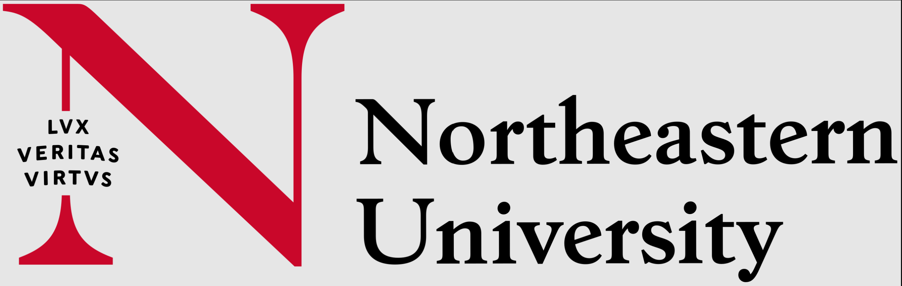

# DS 3000: Foundations of Data Science

  
    
  <h2>Foundations of Data Science</h2>
  
<strong>4 Credit Hours | Khoury College of Computer Science</strong>

## 📚 Course Overview

**DS 3000** introduces methods and concepts from linear algebra and probability that form a basis for modern machine learning. Emphasizes computational aspects using the Python programming language (the course assumes familiarity with Python). Students work with tensors (in NumPy) and may be tasked with implementing from scratch algorithms central to numerical linear algebra and introductory machine learning.

## 📋 Course Details

| Category                    | Information |
| :-------------------------- | :---------- |
| **Semester**                | Fall 2025   |
| **Grade Earned**            | - |

---

  
<em>© Vignesh Saravanakumar 2025 | Northeastern University</em>

